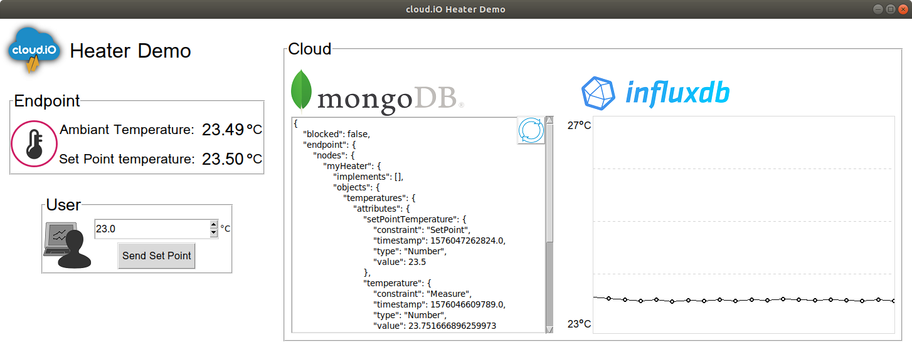

# cloudio-heater-demo

## Description

This software is a demonstration of a smart heating system using [cloud.iO](http://cloudio.hevs.ch). On this software is represented the two actors of cloud.iO, the endpoint and the user, and the cloud part with the two dtabase of cloud.iO : mongo db and influx db.

This software is using the cloud.iO RESTfull api. It is needed to have a cloud.iO username and password to use this software and to have an instance of the [cloud.iO core](https://github.com/cloudio-project/cloudio-services) running. You may also need the demo java implementation fo the heater available in this [cloudio-endpointHeater-demo](https://github.com/lucblender/cloudio-endpointHeater-demo) repository.

## Requirement

This software run with python 3, tested for 3.6 and above. The following packages are needed:
  - requests
  - tkinter
  - pygubu

## Launch

```python heaterDemo.py``` 

## GUI description

The upper left part represent the actual heater (Endpoint part). It show the ambiant temperature and the set point temperature, both refreshed every second. Lower left part represent an interaction from the user to the Endpoint: setting the set point temperature. With the spiner it is possible to change the temperature and with the button under it, to send the temperature to the endpoint for it to regulate.

The right part represent the data stored in the cloud. On the mongo db part we can see the retreived digital twin on the heater following the cloud.iO model, this model can be updated with the upper right button. On the influx db part we can see the temperature evolving through time.


